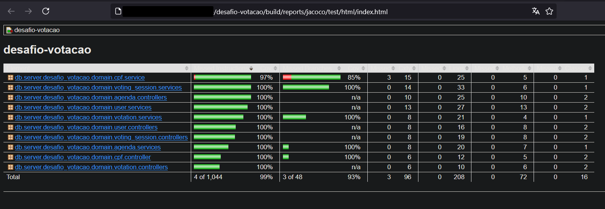
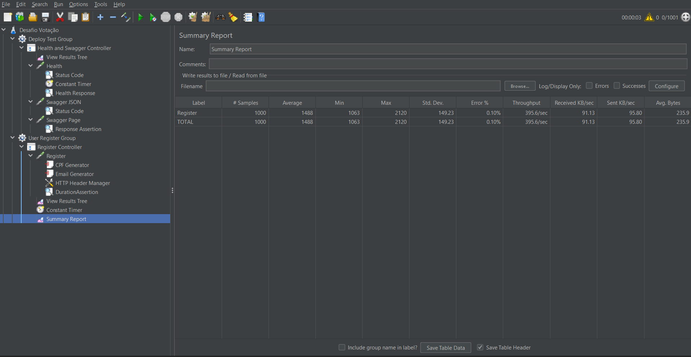

<p align="center"></p>
<h2 align="center">Desafio Votação - Caio Porcel</h2>

> API Rest para votação de temas em SpringBoot.

## Sobre o projeto

Esta aplicação foi desenvolvida como parte do teste técnico para vaga de Desenvolvedor Fullstack Pleno na
Consultoria [DB Server](https://db.tec.br/). Você pode encontrar o repositório original [aqui](https://github.com/dbserver/desafio-votacao).

## Acesso às Funcionalidades

- [Swagger](http://localhost:8080/api/docs/swagger.html)
- [HealthCheck](http://localhost:8080/management/health)

## Tecnologias Utilizadas

- [Spring Boot](https://spring.io/projects/spring-boot);
- [Spring Data JPA](https://spring.io/projects/spring-data-jpa);
- [Postgres](https://www.postgresql.org/);
- [Springdoc (Swagger e OpenAPI)](https://springdoc.org/);
- [Spring Actuator](https://spring.io/guides/gs/actuator-service);
- [JUnit](https://junit.org/), [Mockito](https://site.mockito.org/) e [JaCoCo](https://www.eclemma.org/jacoco/);
- [JMeter](https://jmeter.apache.org/)

## Rodando o Projeto

### Configurações de Ambiente

A aplicação possui dois ambientes configurados:

1. [deploy](./src/main/resources/application-deploy.yml): deploy em ambientes na nuvem;
2. [dev](./src/main/resources/application-dev.yml): para desenvolvimento local;

A configuração [default](./src/main/resources/application.yml) contém definições necessárias para ambos os ambientes.

### Docker Compose

A forma mais simples de iniciar a aplicação é pelo [Docker](./docker-compose.yml).

Primeiro, faça o build da imagem:

```sh
docker compose build
```

Depois, inicie o container:

```sh
docker compose up
```

### Utilizando Gradle

A API necessita de uma instância do Postgres para funcionamento. Você pode [iniciá-la separadamente pelo Docker](#rodando-o-postgres-individualmente-no-docker) ou instalar no seu próprio computador.

Com o banco de dados rodando, instale as dependências e inicie o app:

```sh
./gradlew bootRun --args='--spring.profiles.active=dev'
```


## Verificando cobertura de código (Code Coverage)

Para acessar as porcentagens de cobertura de testes da aplicação, rode a tarefa de testes:

```sh
./gradlew clean test
```

E acesse em seu navegador o [arquivo gerado pelo JaCoCo](./build/reports/jacoco/test/html/index.html):




## Desabilitando Validações

Hoje, existem algumas validações que podem ser configuradas, [como de CPF](./src/main/java/db/server/desafio_votacao/domain/cpf/service/CPFValidator.java) e de [elegibilidade do usuário](./src/main/java/db/server/desafio_votacao/domain/user/services/UserEligibilityService.java).

Você pode alterar essas definições em qualquer um dos arquivos [application.yml](./src/main/resources/application.yml), conforme a necessidade:

```yml
cpf:
  validator:
    enabled: false
user-eligibility:
  validator:
    enabled: false
```

## Testes de Performance

Durante o desenvolvimento, foi escrito um teste de performance utilizando o JMeter para a funcionalidade de
inscrição de usuários, além de um teste de disponibilidade dos endpoints de deploy (actuator, swagger).

Para rodar o teste, abra o arquivo [jmx](./jmeter/Desafio%20Votação.jmx) no JMeter e execute-o:



* **Importante**: desabilite as validações de CPF nos testes de performance.

## Configurando os endpoints

Os endpoints disponíveis são configuráveis na aplicação, e você pode alterá-los no arquivo [application.yml](./src/main/resources/application.yml):

```yml
endpoint:
  agenda:
    findById: /agenda/{id}
    findAll: /agenda
    create: /agenda
    update: /agenda/{id}
    delete: /agenda/{id}
  cpf:
    validate: /cpf/{cpf}
  user:
    register: /user/register
    find-all: /user
  votation:
    vote: /votation/vote
    results: /votation/result/{id}
  voting-session:
    findById: /votation/voting-session/{id}
    findAll: /votation/voting-session
    create: /votation/voting-session
```

## Apêndice

### Rodando o Postgres individualmente no Docker

```sh
docker run --env=POSTGRES_PASSWORD=dummypassword --env=POSTGRES_DB=desafio_votacao -p 5432:5432 -d postgres
```

